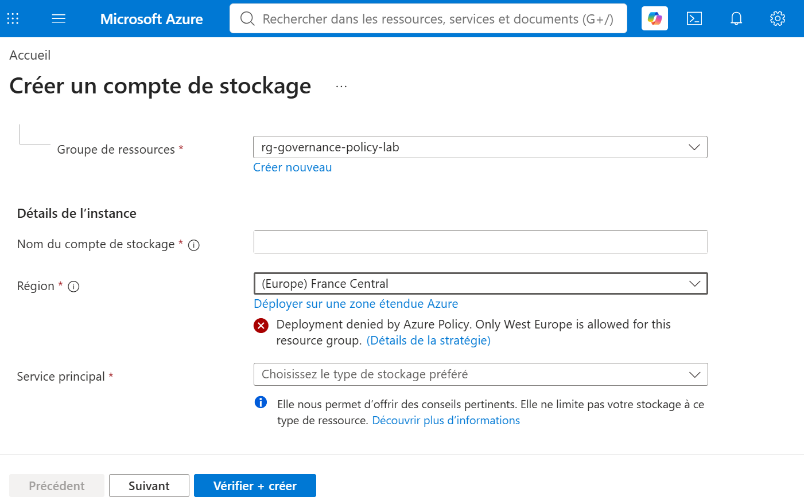
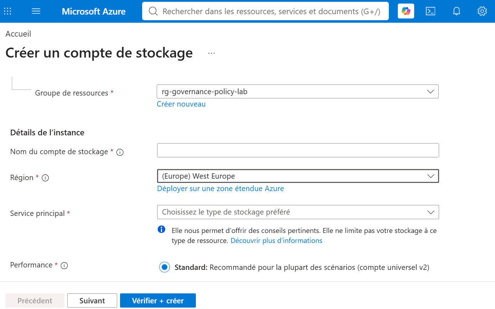
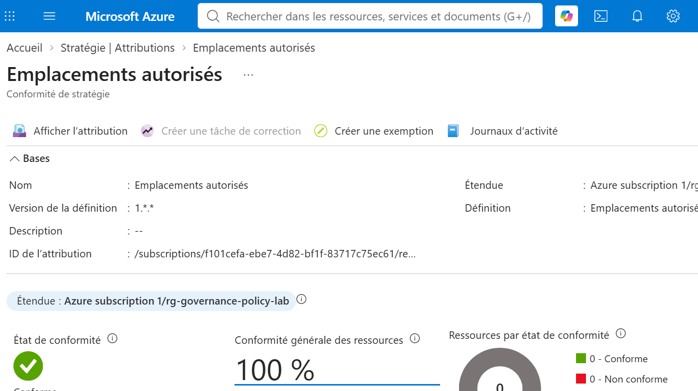
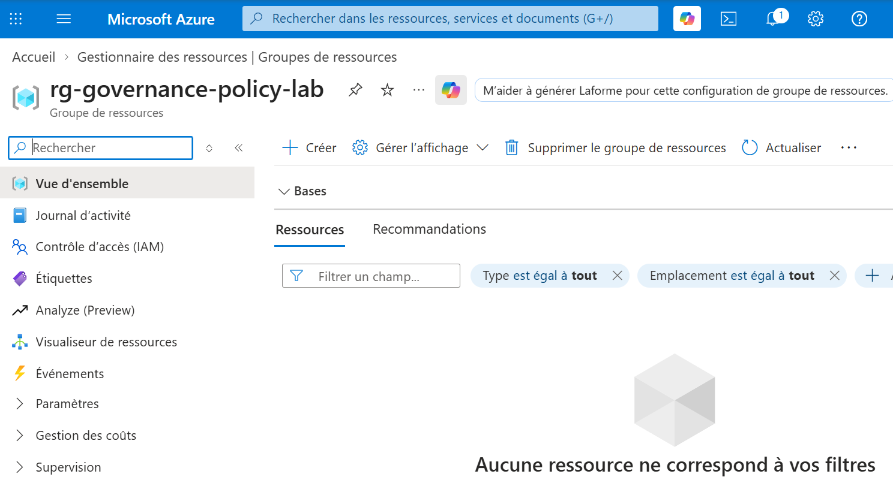
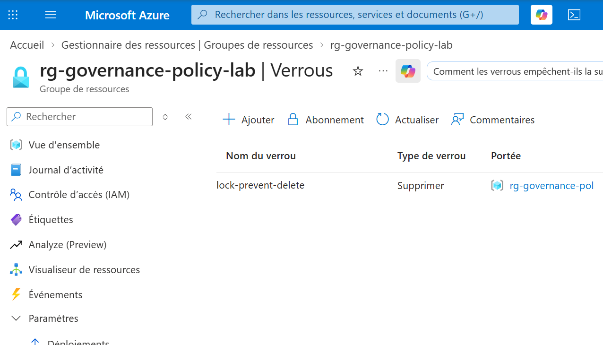
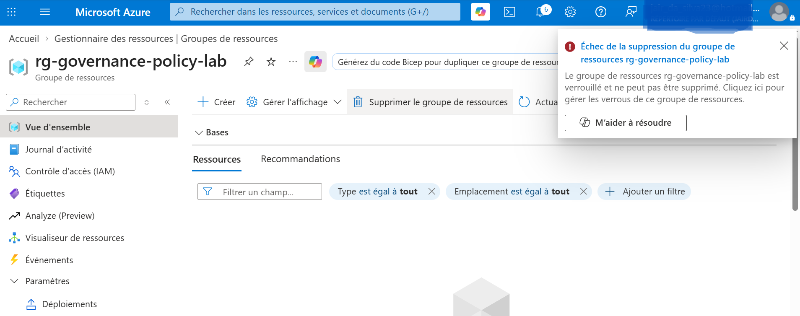

# Azure Governance – Azure Policy et Resource Locks

## 🎯 Objectif

Déployer et tester des mécanismes de gouvernance et de protection des ressources dans Microsoft Azure à l'aide de **Azure Policy** et **Azure Resource Locks**.

L'objectif de ce laboratoire est de simuler l'application de règles de gouvernance dans une entreprise :

- création d'un groupe de ressources dédié ;
- attribution d'une stratégie Azure Policy ;
- restriction des déploiements à la région **West Europe** ;
- vérification du refus d'une région non autorisée ;
- vérification de l'acceptation d'une région autorisée ;
- consultation de la conformité de la stratégie ;
- création d'un verrou de suppression ;
- validation de la protection du groupe de ressources contre la suppression.

Ce projet a été réalisé dans le cadre de ma préparation à la certification **Microsoft Azure AZ-104**, afin de développer mes compétences en gouvernance, conformité et protection des ressources Azure.

---

## 💻 Technologies utilisées

- Microsoft Azure
- Azure Policy
- Azure Resource Manager
- Azure Resource Groups
- Azure Resource Locks
- Azure Policy Assignments
- Azure Policy Compliance
- Azure Storage Accounts
- Azure Portal

---

## 🏗️ Architecture

```text
             Microsoft Azure
                    |
                    v
       rg-governance-policy-lab
             Resource Group
                    |
          +---------+---------+
          |                   |
          v                   v
      Azure Policy       Resource Lock
          |                   |
          v                   v
  Allowed Locations       CanNotDelete
          |                   |
          v                   v
    West Europe          Protection contre
     uniquement            la suppression
          |
          v
  France Central : DENY
  West Europe    : ALLOW
```

La stratégie **Azure Policy** contrôle les régions dans lesquelles les ressources peuvent être déployées.

Le verrou **CanNotDelete** protège le groupe de ressources contre une suppression accidentelle.

Ces deux mécanismes répondent à des objectifs complémentaires : la gouvernance des déploiements et la protection des ressources.

---

## 🎯 Résultat

Le laboratoire a permis de valider le fonctionnement d'Azure Policy et des verrous de ressources Azure.

Les tests réalisés ont confirmé que :

- une stratégie Azure Policy peut être attribuée à un Resource Group ;
- une restriction géographique peut être appliquée aux déploiements ;
- la région **France Central** est refusée par la stratégie ;
- la région **West Europe** est autorisée ;
- le portail Azure permet de consulter l'état de conformité ;
- un verrou de suppression peut être appliqué à un Resource Group ;
- la suppression du groupe est bloquée lorsque le verrou est actif.

Ce laboratoire démontre comment Azure permet de mettre en place des règles de gouvernance et de protéger les ressources contre certaines opérations non autorisées ou accidentelles.

---

## 👤 Auteur

**Jair Da Silva**

Technicien Systèmes & Réseaux | Support IT N1/N2 | Microsoft Azure

GitHub : https://github.com/jairdasilva-it

LinkedIn : https://www.linkedin.com/in/jair-da-silva-6b14aa278

---

# 🚀 Étapes du projet

## 1️⃣ Création du groupe de ressources

Création d'un groupe de ressources dédié aux tests de gouvernance Azure.

Nom du Resource Group :

```text
rg-governance-policy-lab
```

Ce groupe sert de périmètre pour l'application des stratégies et des verrous.

---

## 2️⃣ Attribution d'une stratégie Azure Policy

Depuis le service **Stratégie (Azure Policy)**, attribution de la définition intégrée :

```text
Emplacements autorisés
```

La stratégie est appliquée au groupe de ressources :

```text
rg-governance-policy-lab
```

Le paramètre des emplacements autorisés est configuré pour accepter uniquement :

```text
West Europe
```

Cette configuration permet de contrôler les régions dans lesquelles les ressources peuvent être créées.

---

## 3️⃣ Test d'une région non autorisée

Une tentative de création d'un compte de stockage est effectuée dans la région :

```text
France Central
```

Azure affiche le message :

```text
Deployment denied by Azure Policy.
Only West Europe is allowed for this resource group.
```

Ce refus confirme que la stratégie Azure Policy est appliquée et empêche l'utilisation d'une région non autorisée.

---

## 4️⃣ Vérification d'une région autorisée

La région du compte de stockage est ensuite modifiée :

```text
West Europe
```

Le message de refus Azure Policy disparaît.

Ce test confirme que la région sélectionnée respecte les paramètres de la stratégie.

La validation porte ici sur l'autorisation de la région, sans nécessiter le déploiement effectif du compte de stockage.

---

## 5️⃣ Vérification de la conformité Azure Policy

Depuis le service **Stratégie**, consultation de la conformité de l'attribution :

```text
Emplacements autorisés
```

Le portail Azure affiche :

```text
État : Conforme
Conformité générale : 100 %
Ressources évaluées : 0
```

Ce résultat indique que l'attribution est affichée comme conforme au moment du contrôle.

Toutefois, aucune ressource n'étant évaluée, ce pourcentage ne constitue pas à lui seul une preuve de conformité de ressources déployées.

La validation pratique de la stratégie repose également sur les tests de refus et d'autorisation des régions.

---

## 6️⃣ Création d'un verrou de suppression

Depuis le groupe de ressources :

```text
rg-governance-policy-lab
```

Ouverture de la section :

```text
Paramètres > Verrous
```

Création du verrou :

```text
Nom : lock-prevent-delete
Type : CanNotDelete
Portée : rg-governance-policy-lab
```

Le verrou empêche la suppression du groupe de ressources et protège également les ressources comprises dans son périmètre contre les opérations de suppression.

---

## 7️⃣ Validation du verrou

Une tentative de suppression du Resource Group est effectuée.

Azure affiche un message indiquant que le groupe de ressources est verrouillé et ne peut pas être supprimé.

Le verrou :

```text
lock-prevent-delete
```

empêche donc l'opération.

Ce test confirme le fonctionnement du mécanisme **CanNotDelete**.

---

# 📸 Captures d'écran

## Azure Policy

### 1. Refus d'un déploiement en France Central

Azure Policy affiche un message de refus lorsque la région France Central est sélectionnée pour la création du compte de stockage.



---

### 2. Validation de la région West Europe

La région West Europe est sélectionnée et aucun message de refus lié à Azure Policy n'apparaît.



---

### 3. Vérification de la conformité Azure Policy

Consultation de l'état de conformité de la stratégie Emplacements autorisés.

Le portail affiche 100 % de conformité avec aucune ressource évaluée.



---

## Azure Resource Locks

### 4. Vue d'ensemble du groupe de ressources

Présentation du Resource Group utilisé pour les tests de gouvernance et de protection.



---

### 5. Création du verrou de suppression

Le verrou `lock-prevent-delete` est présent dans la configuration du groupe de ressources.



---

### 6. Validation du verrou

Azure refuse la suppression du groupe de ressources en raison de la présence du verrou.



---

# 🔐 Principes de gouvernance appliqués

## Azure Policy

Azure Policy permet de définir et d'appliquer des règles de gouvernance sur les ressources Azure.

Dans ce laboratoire :

```text
Resource Group
      |
      v
Azure Policy
      |
      v
Allowed Locations
      |
      v
West Europe uniquement
      |
      +--> West Europe : autorisé
      |
      +--> France Central : refusé
```

Cette approche permet de contrôler les emplacements de déploiement des ressources et de faire respecter des règles définies par l'organisation.

## Azure Resource Locks

Les verrous de ressources permettent de protéger les ressources contre certaines opérations.

Deux types principaux existent :

- **CanNotDelete** : empêche la suppression tout en autorisant les modifications compatibles avec le verrou.
- **ReadOnly** : empêche les modifications et la suppression au niveau du plan de gestion.

Dans ce laboratoire, le verrou **CanNotDelete** est utilisé pour empêcher la suppression accidentelle du groupe de ressources.

---

# ✅ Validation

Les éléments suivants ont été testés et validés :

- création d'un Resource Group dédié ;
- utilisation d'Azure Policy ;
- attribution d'une stratégie intégrée ;
- définition d'une restriction géographique ;
- application de la stratégie à un Resource Group ;
- refus d'une région non autorisée ;
- autorisation de la région West Europe ;
- consultation de la conformité Azure Policy ;
- création d'un verrou CanNotDelete ;
- vérification de la présence du verrou ;
- tentative de suppression du Resource Group ;
- confirmation du blocage de la suppression.

---

# 📚 Ce que j'ai appris

Ce projet m'a permis d'apprendre à :

- comprendre les principes de gouvernance Azure ;
- utiliser les stratégies Azure Policy ;
- attribuer une stratégie à un périmètre précis ;
- configurer les paramètres d'une stratégie ;
- contrôler les régions de déploiement ;
- interpréter les messages de refus Azure Policy ;
- consulter les informations de conformité ;
- distinguer une stratégie conforme d'une ressource effectivement évaluée ;
- comprendre le fonctionnement des verrous Azure ;
- configurer un verrou CanNotDelete ;
- protéger un Resource Group contre une suppression accidentelle ;
- tester et valider les mécanismes de protection.

---

# 💼 Compétences démontrées

- Administration Microsoft Azure
- Azure Governance
- Azure Policy
- Azure Policy Assignments
- Azure Policy Compliance
- Azure Resource Manager
- Azure Resource Groups
- Azure Resource Locks
- Gestion des restrictions géographiques
- Contrôle des déploiements Azure
- Protection des ressources Azure
- Application de règles de gouvernance
- Vérification de conformité
- Test et validation des politiques Azure
- Prévention des suppressions accidentelles
- Administration des ressources Cloud
- Préparation à la certification Microsoft Azure AZ-104
